# 🚀 Service Base for Generative AI APIs — FastAPI & React

This project provides a robust and comprehensive foundation for building generative AI APIs, similar to those offered by OpenAI or Gemini. It combines essential features often found in separate services, such as API Gateway functionalities (like Kong) and wallet/metering capabilities (like OpenMeter), into a single, integrated open-source solution.

## Key Features

This project is designed to accelerate your development of AI-powered web services by offering out-of-the-box support for:

- **OAuth2.0 Authentication**: Secure user authentication and authorization.
- **API Key Management**: Robust system for generating, managing, and revoking API keys for your users.
- **API Gateway Functionality**: Core features for routing and managing API requests.
- **Stripe Payment Integration**: Seamless handling of payments and subscriptions.
- **User Wallet System**: Integrated wallet for managing user balances.
- **Wallet Transaction Tracking**: Detailed logging and display of all wallet transactions.
- **Organization Management**: Support for managing users within organizations.

## Why This Project?

Building a secure and scalable AI web service from scratch involves significant effort, especially when dealing with authentication, API management, and billing. While libraries like `fastapi-users` simplify authentication, integrating various components like OAuth, API key management, and payment systems can be time-consuming and prone to security vulnerabilities if not handled correctly.

This project aims to save you time and provide a clean, secure, and well-structured starting point. It addresses common challenges by offering a pre-configured, integrated solution that combines the best practices for:

- **API Docs (OpenAPI):** [https://raw.githubusercontent.com/PeterTakahashi/service-base-fastapi/refs/heads/main/docs/openapi.json](https://raw.githubusercontent.com/PeterTakahashi/service-base-fastapi/refs/heads/main/docs/openapi.json)
- **Frontend Storybook:** [https://service-base-react-vite-storybook.vercel.app/?path=/docs/configure-your-project--docs](https://service-base-react-vite-storybook.vercel.app/?path=/docs/configure-your-project--docs)
- **Backend Repository:** [https://github.com/PeterTakahashi/service-base-fastapi.git](https://github.com/PeterTakahashi/service-base-fastapi.git)
- **Frontend Repository:** [https://github.com/PeterTakahashi/service-base-react-vite.git](https://github.com/PeterTakahashi/service-base-react-vite.git)

## Backend Repository

https://github.com/PeterTakahashi/service-base-auth-fastapi

## Versions

- node 22.12.0
- react 19.1.0
- tailwindcss 4.1.7
- vite 6.3.5
- axios 1.9.0
- swr 2.3.3

## Get started

```sh
npm install
npm run dev
npm run storybook # if you want to see storybook
```

## openapi type rebuild

```sh
npx openapi-typescript config/openapi.json --output src/types/api/base.ts
```

## screan shots

### SignIn

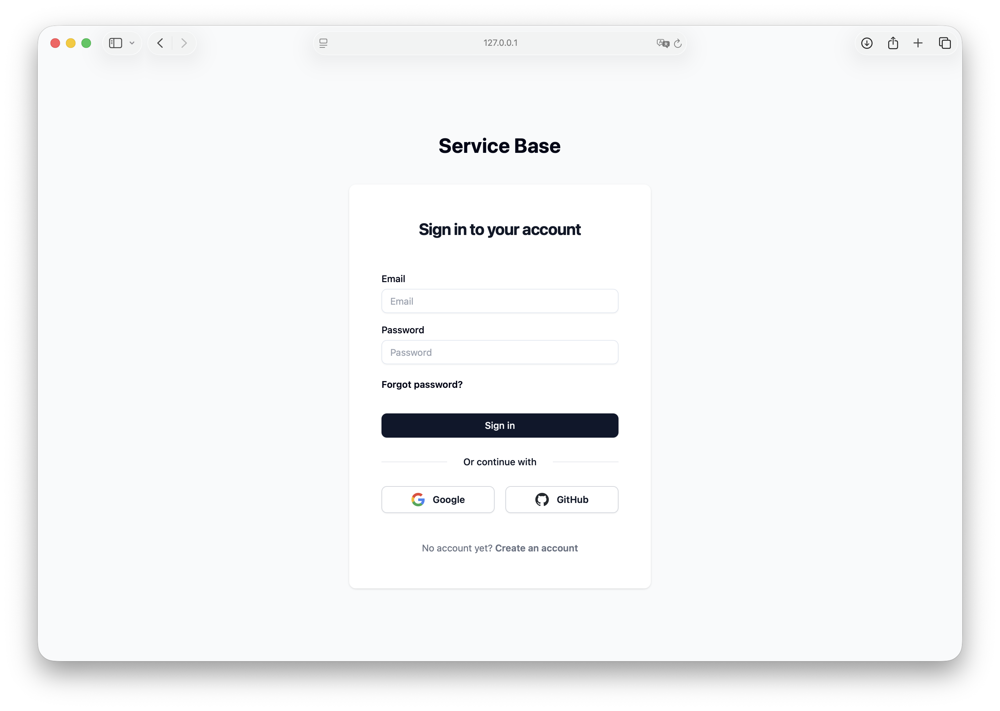

### Account

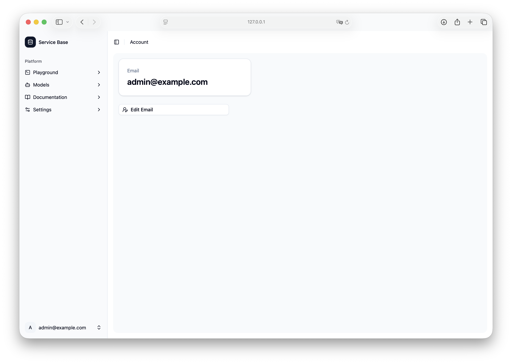

### Add Funds

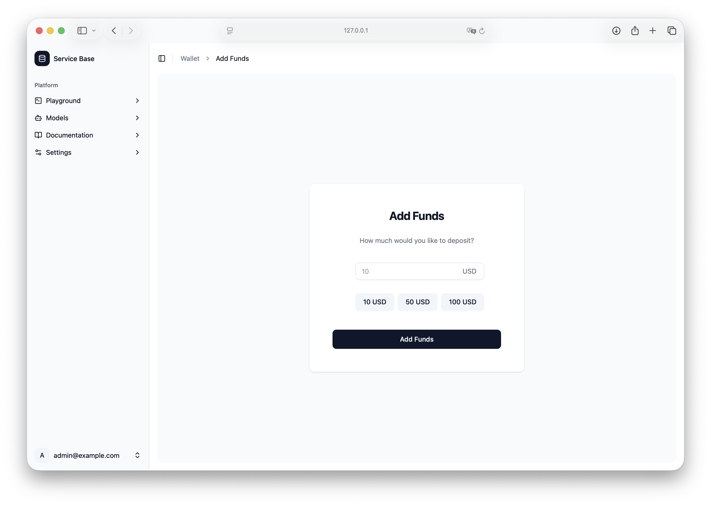

### API Key List

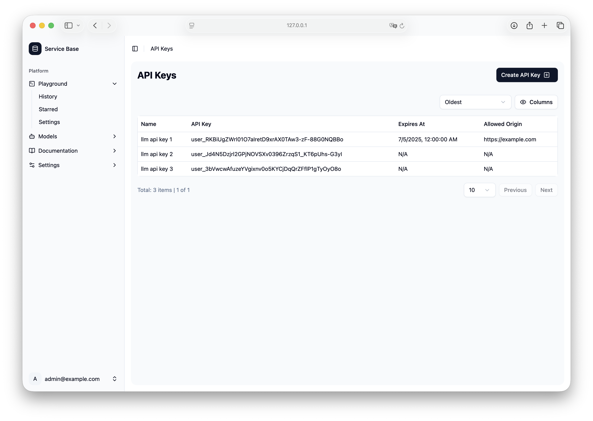

### Create API Key

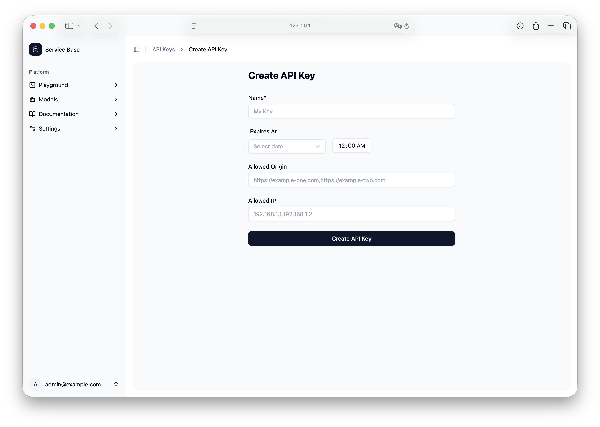

### Edit Email

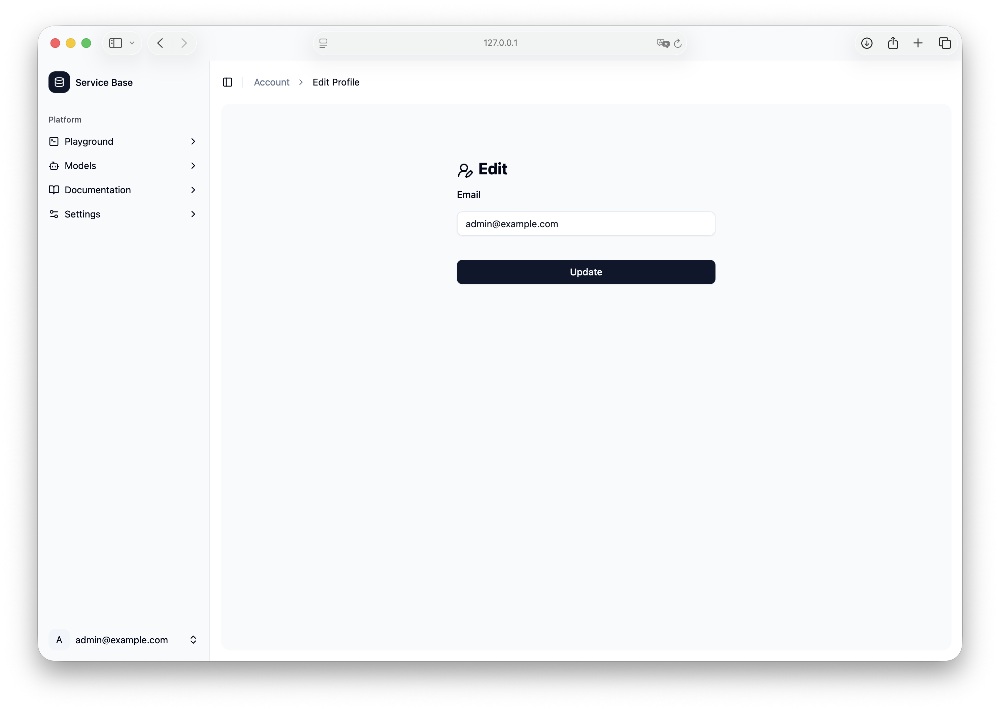

### Forgot Password

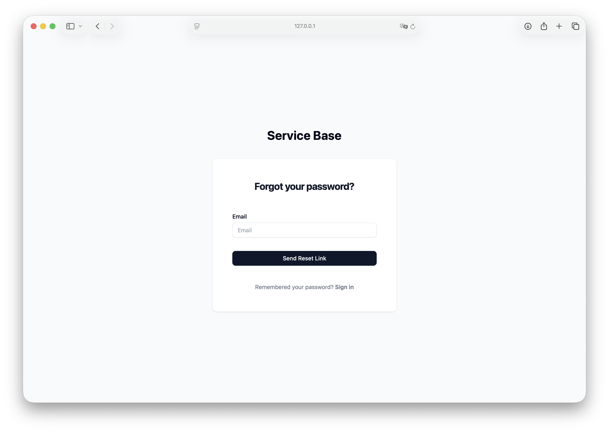

### Home

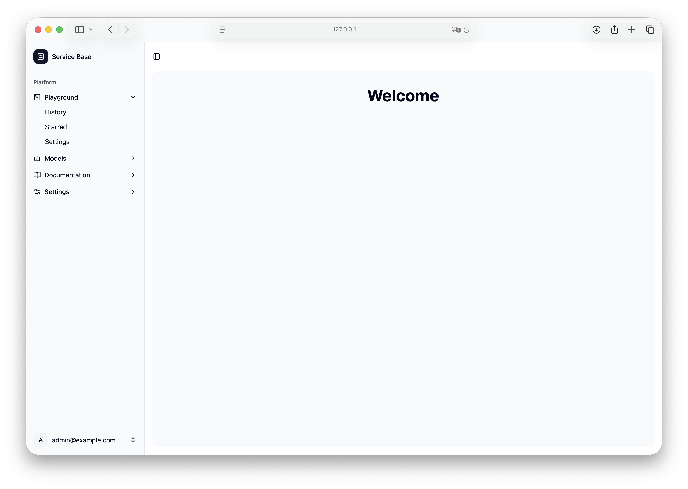

### Input Card


### Sign Up

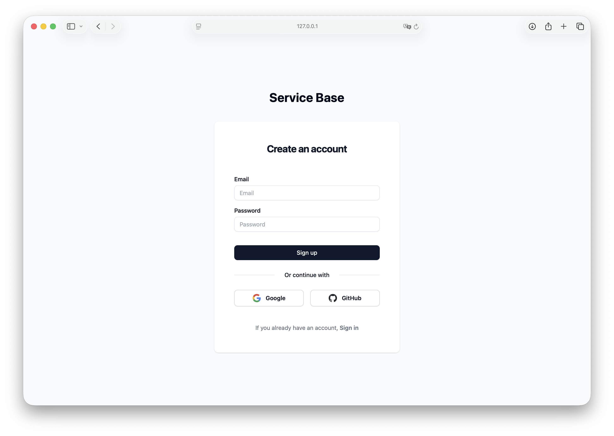

### Transactions

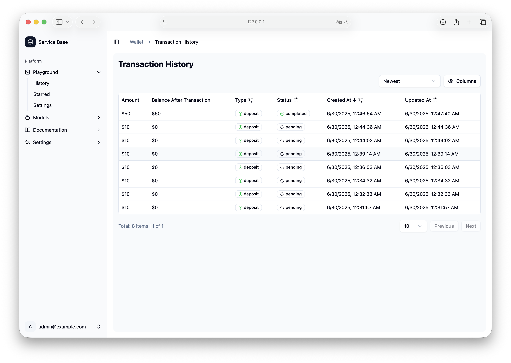

### Wallet

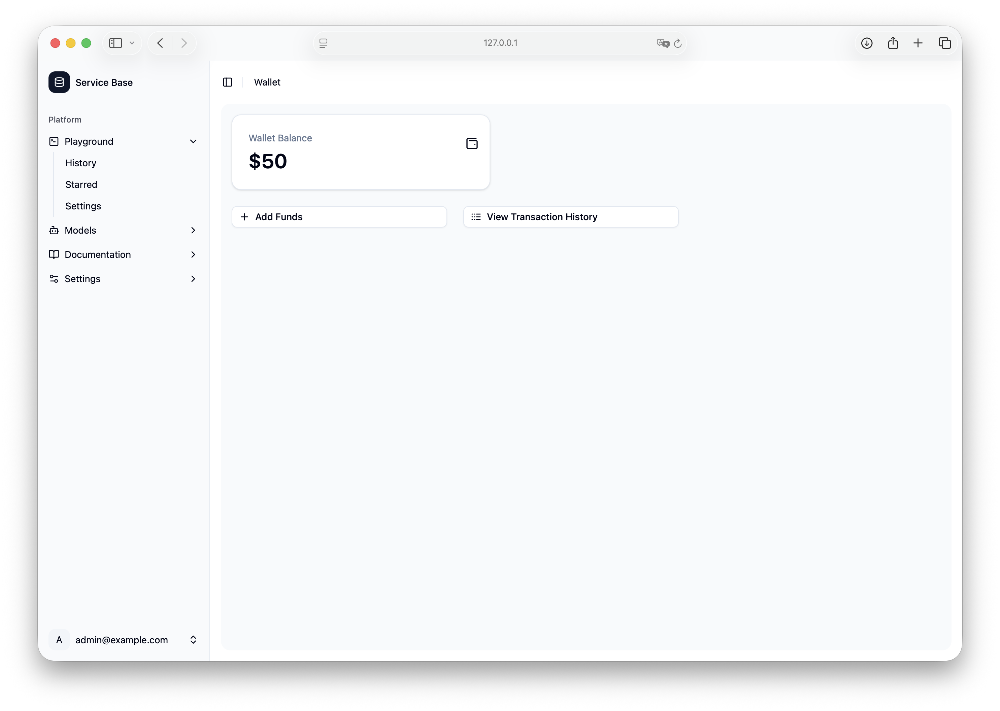
